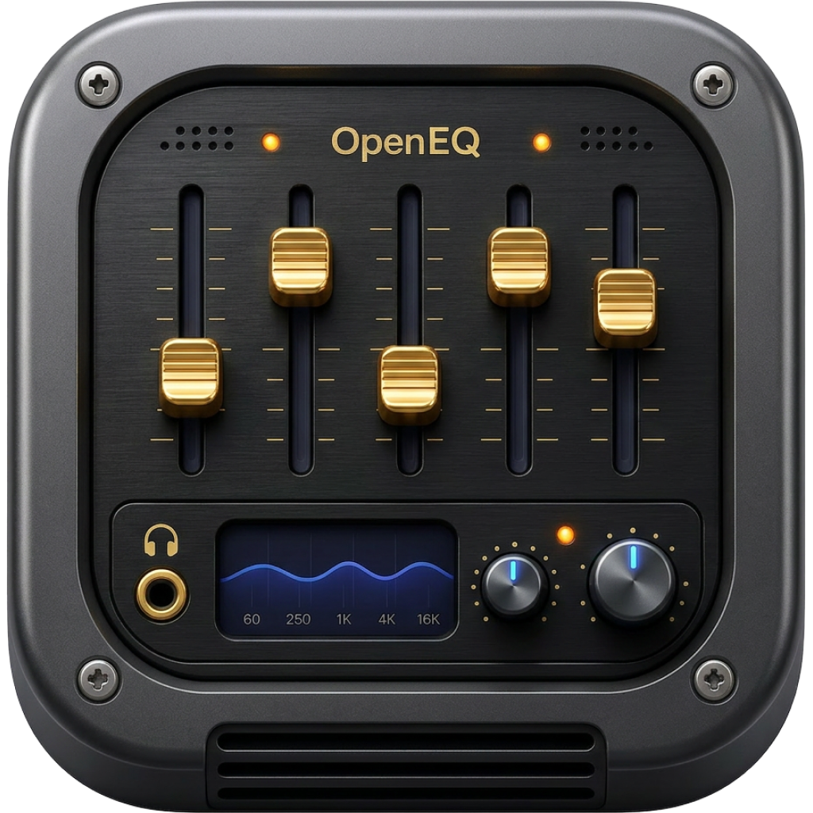

<p align="center">
  
</p>

# OpenEQ

An open-source macOS audio equalizer built with **SwiftUI**, **AVFoundation**, **Core Audio**, and **Accelerate (vDSP)**.

OpenEQ is a lightweight desktop EQ for:

1. **Local files** (production-ready) — open a track, shape it, A/B with bypass  
2. **System-wide audio** (experimental) — process other apps after granting Screen & System Audio Recording permission  

## What works today (V1)

### Local equalizer (stable)
- **10-band & 31-band** graphic EQ (ISO frequencies)
- **5-band parametric EQ** (frequency, gain, Q, filter type)
- Preamp (`-24` … `+24` dB), EQ bypass, volume boost up to 200%
- Peak limiter on the output path (headroom safety)
- Real-time **64-band FFT spectrum** (Canvas + vDSP)
- Built-in presets + custom save/import/export (JSON)
- Menu bar: bypass, volume, recent presets, playback controls

### System audio (experimental)
Requires **macOS 14.2+** and **Screen & System Audio Recording** permission.

| Mode | What it does | Notes |
|------|----------------|-------|
| **System-Wide EQ** | Core Audio process tap → biquad EQ + limiter → private aggregate device | No BlackHole install; still edge-case sensitive (device hops, permission) |
| **External Loopback** | Process a virtual input (e.g. BlackHole) through OpenEQ | Explicit routing; advanced users |
| **Disabled** | Local files only | Default |

**Not claimed yet:** zero-latency virtual driver, install-free perfect system routing on every hardware setup, or multi-channel Atmos calibration.

Safety nets: unified bypass, emergency stop / safe mode (restores default output), latency readout, permission recovery to System Settings.

Details: [docs/system-audio.md](docs/system-audio.md).

### Keyboard shortcuts

| Shortcut | Action |
|----------|--------|
| `⌘O` | Open audio file |
| `⌘R` | Reset EQ |
| `⌘B` | Toggle EQ bypass |
| `⌘⇧V` | Toggle volume boost |
| `Space` | Play / pause |

## Architecture

```
SwiftUI Views → OpenEQViewModel → AudioEngineController   (local files)
                               → SystemAudioManager
                                    ├─ SystemAudioEQEngine      (process tap + aggregate)
                                    └─ ExternalLoopbackEngine   (BlackHole path)
```

- Local path: `AVAudioEngine` + `AVAudioPlayerNode` + `AVAudioUnitEQ` + peak limiter  
- System path: `CATapDescription` + aggregate device + manual biquad DSP + peak limiter  
- Spectrum: vDSP FFT, Hanning window, decay smoothing  

See [docs/architecture.md](docs/architecture.md), [docs/ROADMAP.md](docs/ROADMAP.md).

## Requirements

- macOS **14.0+** (local EQ)
- macOS **14.2+** (system-wide EQ)
- Xcode 15+ (or matching command-line tools)

## Build

```bash
# Xcode
open OpenEQ.xcodeproj   # scheme OpenEQ → My Mac → ⌘R

# CLI
xcodebuild -project OpenEQ.xcodeproj -scheme OpenEQ -destination 'platform=macOS' build
xcodebuild test -project OpenEQ.xcodeproj -scheme OpenEQ -destination 'platform=macOS'
```

## Contributing

See [CONTRIBUTING.md](CONTRIBUTING.md) and [AGENTS.md](AGENTS.md) for agent/contributor conventions.

## License

MIT — see [LICENSE](LICENSE).
