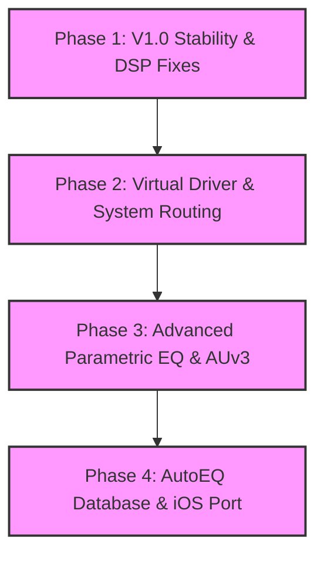

# OpenEQ Master Project Plan: Roadmap, Incomplete Areas, and Test Protocols

This document analyzes the current technical status of **OpenEQ** (macOS Audio Equalizer), lists components that are incomplete or require optimization, provides a future development roadmap, and specifies test cases to ensure the stability of the application.

---

## 🔍 1. Current State & Incomplete Areas

OpenEQ features a robust SwiftUI front-end and AVFoundation processing core. However, an analysis of the codebase reveals several key parts that remain in "Beta," "Experimental," or "Unfinished" stages.

### ⚠️ 1.1. SystemAudioEQEngine (System-wide EQ Processing)
*   **Current Status:** Uses Apple's macOS 14.2+ `CATapDescription` API and a dynamically configured Core Audio aggregate device (`AudioHardwareCreateAggregateDevice`).
*   **Incomplete / Optimization Areas:**
    1.  **Experimental Audio Filtering (Biquad Formula):** The Biquad filter coefficients in `applyEQ` are calculated inline within the real-time buffer processing callback. **This adds unnecessary CPU overhead and is highly sensitive to latency.** Furthermore, there is no parameter smoothing, which causes audible pops/crackles when adjusting equalizer faders.
    2.  **Synthetic Audio Output on Silence:** When the input buffer is empty, the engine falls back to synthesizing a 440 Hz sine wave (`sin(Self.testPhase) * 0.02`). This generates a continuous tone or digital hum when no audio is playing. This test signal must be completely removed for production.
    3.  **Active Device Synchronization:** There is a risk of audio drops or aggregate device failure when the user connects or disconnects output devices (e.g., unplugging headphones). Dynamic hardware tracking is not fully integrated.

### ⚠️ 1.2. AudioEngineController (Local Audio File Player)
*   **Current Status:** Decodes and plays local files (MP3, WAV, etc.) using `AVAudioEngine`.
*   **Incomplete / Optimization Areas:**
    1.  **Sample-Rate Mismatch Glitches:** When switching between audio files with differing sample rates (e.g., 44.1 kHz to 96 kHz), the entire engine is paused and rebuilt (`connectGraph`). This results in a noticeable silence gap of 200-400 ms.
    2.  **Memory Management:** Although `[weak self]` is utilized, explicit removal and cleanup of audio tap callbacks (`removeTap`) under all engine stop states needs validation to prevent minor memory leaks.

### ⚠️ 1.3. Test Coverage
*   **Current Status:** Test target bundles (`OpenEQTests` and `OpenEQUITests`) contain boilerplate code from Apple's template. **There are currently no real tests validating DSP calculations, decibel conversions, file operations, or state machine transitions.**

---

## 🗺️ 2. Future Roadmap

A 4-phase project execution roadmap designed to transform OpenEQ into a production-ready application:



### 🟩 PHASE 1: V1.0 Stability & DSP Fixes (Q3 2026)
*   **Eliminate Fader Clicking:** Introduce parameter interpolation algorithms to smoothly update Biquad coefficients without clicking artifacts.
*   **Establish Unit Tests:** Create test suites to mathematically verify vDSP operations and helper conversions.
*   **Dynamic Headroom / Peak Limiter:** Prevent digital clipping on high preamp gains by integrating a brickwall limiter.

### 🟦 PHASE 2: Production-grade System Routing (Q4 2026 - Q1 2027)
*   **Embedded Virtual Audio Scriptor:** Bundle an internal DriverKit or HAL plug-in virtual audio driver to remove manual dependencies on external tools like BlackHole.
*   **Dynamic Device Failover:** Support seamless automatic aggregate device rebuilds when swapping output hardware (e.g., speakers to AirPods).
*   **Howling / Feedback Protection:** Implement an automated safety cutoff to disable DSP and prevent high-frequency howling loops.

### 🎛️ PHASE 3: Advanced Sound Design Features (Q2 2027)
*   **Interactive Node Dragging UI:** Drag EQ points directly on a visual graph inside SwiftUI to adjust frequencies and gains.
*   **AUv3 Plugin Hosting:** Allow users to insert external plugins (e.g., FabFilter Pro-Q, Valhalla Reverbs) directly into the macOS system audio path.
*   **Dynamic Range Compression:** Compress dynamic range to enhance dialogue audibility while limiting peaks.

### 🚀 PHASE 4: Smart Calibration & Cross-Platform (Q3 2027+)
*   **AutoEQ Preset Integration:** Download and apply optimized correction curves for over 4000 headphones from the AutoEQ library.
*   **iPadOS & visionOS Adaptation:** Share the Core Audio and vDSP layers with iPad and Apple Vision Pro clients via iCloud sync.

---

## 🧪 3. Test Methodology

Testing audio applications requires separating hardware-dependent code from pure mathematical processing to ensure tests run reliably, including on headless CI servers.

### 3.1. Separating Logic and Audio Math
*   **Pure Functions:** Keep functions that compute filter coefficients, windowing, and desibel-linear math isolated. They should have no side-effects or dependencies on active hardware.
*   **Accuracy Tolerances:** Use XCTest's accuracy APIs (`XCTAssertEqual(result, expected, accuracy: 0.0001)`) rather than absolute equality to evaluate floats.

### 3.2. Asynchronous Audio Testing
*   Use XCTest expectations (`XCTestExpectation`) to handle asynchronous conditions like file load events or state change updates:

```swift
func testAudioFilePreparation() {
    let controller = AudioEngineController()
    let expectation = self.expectation(description: "File successfully prepared")
    
    // Simulate async file loading
    let testFileURL = Bundle(for: type(of: self)).url(forResource: "test_audio", withExtension: "mp3")!
    
    do {
        try controller.prepare(url: testFileURL)
        if case .ready = controller.playbackState {
            expectation.fulfill()
        }
    } catch {
        XCTFail("File load failed: \(error)")
    }
    
    waitForExpectations(timeout: 5.0, handler: nil)
}
```

---

## 📝 4. Detailed Test Scenarios

These test cases must be implemented as automated XCTests and performed manually during releases.

### 📂 4.1. Unit Test Scenarios

#### Scenario UT-01: Logarithmic Decibel Math Validation
*   **Objective:** Verify decibel to linear coefficient mappings.
*   **Inputs:** `preampGain` = `0.0 dB`, `6.02 dB`, `-6.02 dB`, `-24.0 dB`
*   **Steps:**
    1.  Execute the conversion formula in `AudioEngineController`.
    2.  Check outputs against expected linear scale ratios.
*   **Expected Outcome:**
    *   `0.0 dB` -> `1.0` (Unchanged)
    *   `6.02 dB` -> `~2.0` (Gain doubled)
    *   `-6.02 dB` -> `~0.5` (Gain halved)
    *   Validation tolerance (`accuracy`) set to `1e-4`.

#### Scenario UT-02: EQBand Clamping and Boundaries
*   **Objective:** Confirm parameter limits cannot be breached.
*   **Inputs:** Frequency = `10 Hz` / `25,000 Hz`, Gain = `-30.0 dB` / `35.0 dB`
*   **Steps:**
    1.  Create an `EQBand` with `10 Hz`.
    2.  Set `gain` on an existing band to `35.0 dB`.
*   **Expected Outcome:**
    *   The frequency is clamped to the minimum boundary: `20.0 Hz`.
    *   Frequency of `25,000 Hz` is clamped to the maximum boundary: `20,000 Hz`.
    *   Gain values are constrained strictly within `-24.0 dB` to `+24.0 dB`.

#### Scenario UT-03: Spectrum Analyzer Reset Verification
*   **Objective:** Ensure stopping playback clears residual analyzer values.
*   **Inputs:** An active array of random float spectrum magnitudes.
*   **Steps:**
    1.  Call `reset()` on `SpectrumAnalyzer`.
    2.  Verify the resulting `SpectrumAnalysis` struct fields.
*   **Expected Outcome:**
    *   All entries in `levels` array are exactly `0.0`.
    *   Both `leftPeak` and `rightPeak` are exactly `0.0`.
    *   `isClipping` evaluates to `false`.

---

### 🔗 4.2. Integration Test Scenarios

#### Scenario IT-01: Malformed File Error Handling
*   **Objective:** Verify that loading non-audio or corrupt file paths does not crash the application.
*   **Inputs:** Path to a non-audio file (e.g., `corrupt_doc.pdf`).
*   **Steps:**
    1.  Invoke `AudioEngineController.prepare(url:)` with the file path.
    2.  Catch errors and monitor `playbackState`.
*   **Expected Outcome:**
    *   The method throws `AudioEngineError.unsupportedFile`.
    *   The state transitions to `.failed(errorMessage)`, triggering an error dialog.

#### Scenario IT-02: Dynamic Hardware Sample Rate Synchronization
*   **Objective:** Verify that changes in the system output device sample rate trigger a rebuild.
*   **Inputs:** Output device configuration shifts from `44,100 Hz` to `96,000 Hz`.
*   **Steps:**
    1.  Simulate a sample rate switch from Core Audio while `SystemAudioEQEngine` is running.
    2.  Track if `setupAggregateWithOutput()` is invoked.
*   **Expected Outcome:**
    *   `SystemAudioEQEngine` catches the event, stops aggregate IO, and restarts the graph at `96,000 Hz` (maximum 50 ms delay).

---

### 🖥️ 4.3. UI Automation Scenarios

#### Scenario UIT-01: Preset Selection Updates Fader Values
*   **Objective:** Confirm that changing presets updates UI slider bindings.
*   **Steps:**
    1.  Select the "Bass Boost" preset in the UI panel.
    2.  Inspect values of the `32 Hz` and `64 Hz` faders.
    3.  Select the "Flat" preset.
    4.  Inspect the same faders again.
*   **Expected Outcome:**
    *   "Bass Boost" sets faders to `6.0` and `5.5` respectively.
    *   "Flat" immediately returns faders to exactly `0.0`.

---

> [!NOTE]
> These plan templates and parameters are saved in the project's [/Users/ozan/Documents/GitHub/OpenEQ/docs/](file:///Users/ozan/Documents/GitHub/OpenEQ/docs/) directory.
> Refer to these instructions when writing test codes or implementing DriverKit integration in future development cycles.
