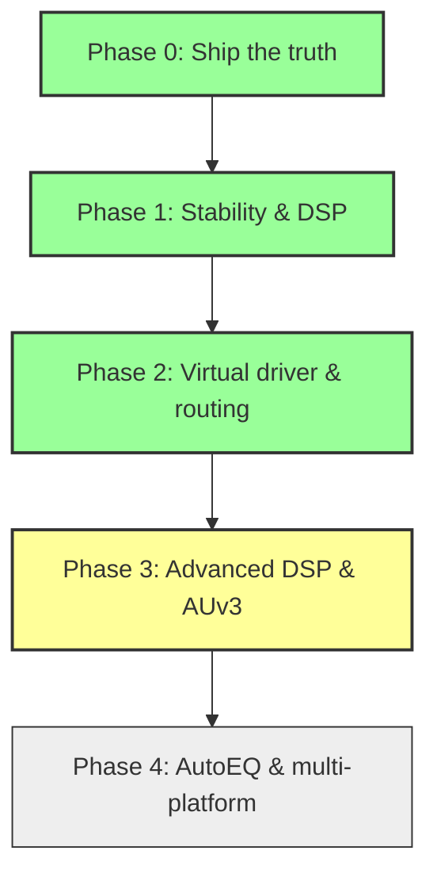

# OpenEQ Master Project Plan

Current technical status, completed work, open gaps, roadmap, and test protocols.

---

## 1. Current state (after Phase 0 + Phase 1)

| Area | Status | Notes |
|------|--------|--------|
| Local file EQ | **Production** | AVAudioEngine graph, peak limiter, format reconnect, bypass |
| Graphic 10/31 + parametric 5 | **Production** | Shared preset model across engines |
| Spectrum / meters | **Production** | vDSP FFT, clipping indicator |
| Presets + menu bar | **Production** | JSON store, recent presets, volume, emergency stop |
| System-Wide EQ (CATap) | **Production-grade experimental** | One-click, feedback guard, sleep/wake, device profiles |
| External loopback | **Advanced / beta** | Requires BlackHole + correct macOS I/O defaults |
| Virtual driver (HAL/DriverKit) | **Researched / deferred** | See `docs/virtual-driver.md` — CATap is primary |
| AutoEQ / AUv3 / iOS | **Not started** | Phase 3–4 |

### Honesty rules (Phase 0)

- Market local EQ as the solid core.
- Label system-wide EQ **experimental**; require permission messaging.
- Do not claim driverless zero-latency perfection until Phase 2 virtual routing ships.
- Keep docs in sync with code (no stale “440 Hz test tone” or “no unit tests” claims).

### Completed in Phase 1 (stability)

1. **Biquad coefficient smoothing** — offline coefficient build + 512-sample transitions (no per-sample recompute of targets in the old broken way).
2. **Peak limiting** — Apple peak limiter on local/loopback; custom peak limiter on system DSP path.
3. **No synthetic silence tone** — empty input zeros output; 440 Hz test signal removed.
4. **Physical output tracking** — aggregate rebuild never treats OpenEQ’s aggregate as the destination device; default-output listener + debounced device churn.
5. **Unified bypass / preamp policy** — same bands + preamp for local, system, and loopback; limiter stays on when EQ is bypassed.
6. **Permission + safe mode UX** — privacy strings, System Settings deep link, emergency stop restores default output.
7. **Unit tests** — EQBand/preset/spectrum/engine prepare-play-stop, dB math, sample-rate style reload, limiter configurator.

### Completed in Phase 2 (routing & safety)

1. **One-click System EQ** — header, menu bar, onboarding sheet; driverless CATap primary path.
2. **FeedbackGuard** — sustained hot-signal mute on system + loopback paths.
3. **Sleep/wake recovery** — resume System EQ after Mac sleep when left enabled.
4. **Device-specific profiles** — UID → preset map in Application Support.
5. **Virtual driver decision** — research doc; HAL/DriverKit deferred, not faked.

### Remaining gaps

| Gap | Severity | Target phase |
|-----|----------|--------------|
| Real bundled virtual output device | Medium | Phase 2.5 / later |
| Stronger correlation-based feedback detection | Medium | Phase 2 follow-up |
| Interactive parametric node UI | Medium | Phase 3 |
| AutoEQ headphone library | Medium (love feature) | Phase 4 |

---

## 2. Roadmap

```mermaid
graph TD
    classDef done fill:#9f9,stroke:#333,stroke-width:2px;
    classDef next fill:#ff9,stroke:#333,stroke-width:2px;
    classDef later fill:#eee,stroke:#333,stroke-width:1px;

    A[Phase 0: Ship the truth] --> B[Phase 1: Stability & DSP]
    B --> C[Phase 2: Virtual driver & routing]
    C --> D[Phase 3: Advanced DSP & AUv3]
    D --> E[Phase 4: AutoEQ & multi-platform]

    class A,B,C done;
    class D next;
    class E later;
```

### Phase 0 — Ship the truth ✅
- Align README / docs with real capabilities
- Clear production vs experimental boundaries

### Phase 1 — Stability & DSP ✅ (core)
- Parameter smoothing, peak limiter, device rebuild hardening
- Unified DSP policy, safe mode, permission recovery
- Expanded XCTest coverage

### Phase 2 — Production system routing ✅ (core)
- One-button System EQ onboarding (driverless CATap)
- Feedback / howling protection + sleep/wake recovery
- Device-specific EQ profiles
- HAL/DriverKit researched and deferred (see virtual-driver.md)

### Phase 3 — Advanced sound design
- Interactive parametric graph (drag nodes, scroll Q)
- Compressor + stronger brickwall options
- AUv3 host in the chain

### Phase 4 — Calibration & platform
- AutoEQ (4000+ headphones)
- REW import
- iPadOS / visionOS shared core (later)

---

## 3. Test methodology

Separate pure math from hardware:

- **Pure functions** for dB, clamps, preset JSON — unit test with accuracy tolerances.
- **Engine tests** use system sounds (e.g. `/System/Library/Sounds/*.aiff`) for prepare/play/stop.
- **System EQ** remains largely manual / integration (permissions + live devices).

### Automated (OpenEQTests)

- EQBand clamping and ISO frequencies  
- Preset JSON round-trip (incl. legacy fields)  
- Spectrum reset + sine peak detection  
- AudioEngine prepare / play / stop / finish / bypass / reload  
- Decibel → linear conversion  
- PeakLimiterConfigurator smoke  

### Manual regression (release checklist)

| ID | Scenario | Expected |
|----|----------|----------|
| MT-01 | Rapid bypass toggle while playing | No pops/dropouts/crash |
| MT-02 | Volume boost max + high preamp | Limiter holds peaks; clip light may flash |
| MT-03 | System EQ start → permission grant | Audio from other apps EQ’d |
| MT-04 | Unplug headphones while System EQ running | Rebuild; sound on new device |
| MT-05 | Emergency Stop | Original default output restored |
| MT-06 | Quit app while System EQ running | Original default output restored |
| MT-07 | Switch files with different rates | Ready state; play works |

---

## 4. Product promise (do not oversell)

**V1 promise**

- Solid local file equalizer with spectrum, presets, menu bar.  
- Experimental system-wide EQ for users who grant permission and accept residual edge cases.  

**Not V1**

- Guaranteed &lt;5 ms system latency on all hardware  
- Install-free replacement for every pro routing tool  
- Perfect AirPods / multi-output edge-case coverage without further work  
