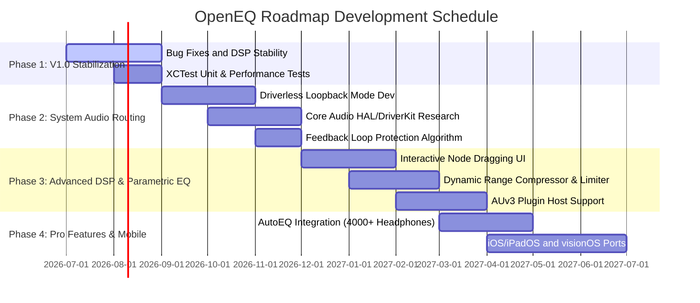

# OpenEQ Development Roadmap

This document outlines the comprehensive development roadmap for the **OpenEQ** audio equalizer application from its V1.0 stable release to the V3.0 vision. The goal of the project is to provide a lightweight, high-performance, open-source, and professional-grade audio processing and routing tool within the macOS ecosystem.

---

## 🗺️ Overview & Phases



---

## 🛠️ PHASE 1: V1.0 Stability, DSP Improvements & Infrastructure (Q3 2026)

**Focus:** Stabilizing the existing local player, 10/31-band graphic equalizer, and 5-band parametric equalizer architecture, preventing memory leaks, and expanding test coverage.

### 1.1. Core DSP Improvements & Output Engine Stability
*   **Dynamic Sample Rate Synchronization:** Strengthening the reconnection logic (`connectGraph`) on AVAudioEngine to prevent audio pops/glitches when switching between files with different sample rates (44.1 kHz, 48 kHz, 96 kHz) during local playback.
*   **Smooth Transition of Biquad Filter Coefficients (Parameter Smoothing):** Smoothing the changes in filter coefficients (using linear interpolation or a low-pass filter) instead of abrupt steps when equalizer faders are moved. This avoids digital clicks and crackling during active fader dragging.
*   **Clipping Prevention Infrastructure:** Integrating a basic Peak Limiter or automatic headroom adjustment to prevent digital clipping when the sum of preamp and band gains exceeds 0 dB.

### 1.2. UI/UX Polish
*   **EQ Curve Visualization (EQ Curve View) Enhancement:** Implementing a combined transfer function curve that displays the joint effect of the 10/31-band graphic EQ and the 5-band parametric EQ in real-time.
*   **FFT Spectrum Analyzer Modes:** Introducing peak hold, adjustable decay times, and log-scaled frequency axis rendering options.
*   **Menu Bar Integration (MenuBarView) Enhancements:** Quick volume slider access, status colors for EQ bypass, and quick switching between the last 3 active presets from the system menu bar.

### 1.3. Testing Infrastructure Setup
*   Writing detailed XCTest unit tests covering DSP conversions (Decibel -> Linear, etc.) and player state machines (see `docs/TESTING_STRATEGY.md` for details).

---

## 🌐 PHASE 2: Advanced System Audio & Virtual Driver Routing (Q4 2026 - Q1 2027)

**Focus:** Building a robust, low-latency system-wide EQ routing engine on macOS without causing feedback loops.

```
+------------------+      +-------------------------+      +-------------------------+
|                  |      |    OpenEQ Virtual       |      |    OpenEQ Engine        |
|  System / App    | ---> |    Audio Device (Input) | ---> |    (DSP, EQ, Limiter)   |
|  Audio Output    |      |    (e.g. BlackHole/HAL) |      |    AVAudioEngine/vDSP   |
+------------------+      +-------------------------+      +-------------------------+
                                                                        |
                                                                        v
                                                           +-------------------------+
                                                           |   Physical Audio Output |
                                                           |   (Speakers, Headphones) |
                                                           +-------------------------+
```

### 2.1. Apple Audio DriverKit (Core Audio HAL Plug-in) Integration
*   **User-Friendly Installation:** Bundle a proprietary Core Audio HAL plug-in (or DriverKit Audio driver) that installs with a single click, removing the need for users to manually configure third-party loopback software like BlackHole.
*   **Automatic Routing:** A background service (`SystemAudioManager`) that redirects the system output to the virtual driver upon app launch and restores the original output device on quit.

### 2.2. Dynamic Device Routing
*   **Headphone/Speaker Transits:** Seamless aggregate device reconfiguration when headphones are plugged in or disconnected (AirPods, Wired Headphones, HDMI outputs).
*   **Device-Specific Profiles:** Auto-loading specific user EQ presets depending on the active output accessory (e.g., distinct curves for AirPods Pro vs. internal Mac speakers).

### 2.3. Safety & Feedback Protection
*   **Feedback Loop Detector:** An intelligent safety system that identifies feedback loops (e.g., routing input/microphone streams back into the source) and mutes the DSP engine within milliseconds to prevent hearing damage.

---

## 🎛️ PHASE 3: Advanced DSP and Parametric Equalizer (Q2 2027)

**Focus:** Moving beyond graphic EQ limitations by offering professional-grade parametric filtering and external plugin hosting.

```
       Gain (dB)
          ^
     +12  |           * * * (Band 3: Peaking)
          |         *       *
      0   |--------*---------*---------*--------- (Flat Reference)
          |      *             *     *   *
     -12  |  * *                 * *       * (Band 1: Low Shelf)
          +----------------------------------------------> Frequency (Hz)
             20Hz     100Hz     1kHz      10kHz
```

### 3.1. Fully Interactive Parametric EQ UI
*   **Node Dragging:** Drag EQ points directly on a graph along the vertical axis (Gain) and horizontal axis (Frequency) for intuitive tuning.
*   **Scroll-to-Q:** Alter filter widths (Q factor) dynamically using the trackpad/scroll wheel while hovering over an EQ node.

### 3.2. Professional Dynamics Processing
*   **vDSP-powered Compressor:** Squeeze the dynamic range of audio to improve vocal clarity and balance audio levels.
*   **Brickwall Limiter:** A fast-acting peak limiter at the output stage to guarantee 100% prevention of digital clipping.
*   **Stereo Panning & Balance:** Independent gain and delay control for left and right channels to customize stereo imaging.

### 3.3. AUv3 (Audio Unit v3) Host Infrastructure
*   Host third-party Audio Units (e.g., FabFilter, Valhalla plugins) within the OpenEQ signal chain, allowing users to apply custom DSP effects directly to system audio.

---

## 🚀 PHASE 4: Pro Features, Smart Calibration & Cross-Platform (Q3 2027+)

**Focus:** Extensive headphone preset libraries, automated measurements, and expansion across the Apple device ecosystem.

### 4.1. AutoEQ Integration & Smart Calibration
*   **4000+ Headphone Curves:** Integrate the [AutoEQ](https://github.com/jaakkopasanen/AutoEQ) database to apply optimal target curves for models from Sennheiser, Sony, Apple AirPods, etc.
*   **Measurement File Import:** Support REW (Room EQ Wizard) JSON/TXT export configurations directly to load calculated room acoustics correction filters.

### 4.2. Multi-Channel Output (Surround/Spatial Audio)
*   Support independent EQ calibration per channel for 5.1, 7.1, and Dolby Atmos audio setups.

### 4.3. Apple Ecosystem Expansion (iOS, iPadOS, visionOS)
*   Adapt the SwiftUI frontend for iPad and Apple Vision Pro, sharing the underlying Core Audio and vDSP processing engine. Cloud synchronization will share custom presets across devices.

---

## 📈 Release Matrix

| Feature / Component | V1.0 (Current/Stable) | V1.5 (End of Phase 1) | V2.0 (End of Phase 2) | V3.0 (Phase 3 & 4) |
| :--- | :--- | :--- | :--- | :--- |
| **Audio Source** | Local Files (MP3/WAV) | Local + Basic Monitor Tap | Full System Audio Routing | Multi-channel Input / Network |
| **Graphic EQ Bands** | 10 & 31 Bands | 10 & 31 Bands (Smooth) | Driver-compatible 31-Band | Unlimited / AutoEQ Profiles |
| **Parametric EQ** | 5 Bands (Basic Control) | 5 Bands + Curve Display | 8 Bands + Node Dragging | Dynamic Bands + AUv3 Hosting |
| **Latency** | ~20ms - 50ms | < 15ms | < 5ms (Virtual Driver) | Near Zero (< 2.5ms) |
| **OS Compatibility** | macOS 14.0+ | macOS 14.0+ | macOS 14.2+ (Advanced HAL) | macOS, iPadOS, visionOS |
