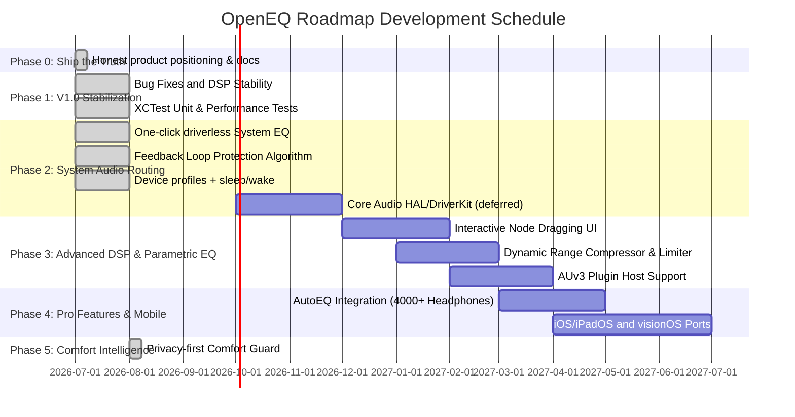

# OpenEQ Development Roadmap

This document outlines the comprehensive development roadmap for the **OpenEQ** audio equalizer application from its V1.0 stable release to the V3.0 vision. The goal of the project is to provide a lightweight, high-performance, open-source, and professional-grade audio processing and routing tool within the macOS ecosystem.

---

## 🗺️ Overview & Phases


```mermaid
gantt
    title OpenEQ Roadmap Development Schedule
    dateFormat  YYYY-MM
    section Phase 0: Ship the Truth
    Honest product positioning & docs    :done, p0_1, 2026-07, 1w
    section Phase 1: V1.0 Stabilization
    Bug Fixes and DSP Stability          :done, p1_1, 2026-07, 1M
    XCTest Unit & Performance Tests      :done, p1_2, 2026-07, 1M
    section Phase 2: System Audio Routing
    One-click driverless System EQ       :done, p2_1, 2026-07, 1M
    Feedback Loop Protection Algorithm   :done, p2_2, 2026-07, 1M
    Device profiles + sleep/wake         :done, p2_3, 2026-07, 1M
    Core Audio HAL/DriverKit (deferred)  :p2_4, 2026-10, 2M
    section Phase 3: Advanced DSP & Parametric EQ
    Interactive Node Dragging UI         :p3_1, 2026-12, 2M
    Dynamic Range Compressor & Limiter   :p3_2, 2027-01, 2M
    AUv3 Plugin Host Support             :p3_3, 2027-02, 2M
    section Phase 4: Pro Features & Mobile
    AutoEQ Integration (4000+ Headphones):p4_1, 2027-03, 2M
    iOS/iPadOS and visionOS Ports        :p4_2, 2027-04, 3M
    section Phase 5: Comfort Intelligence
    Privacy-first Comfort Guard          :done, p5_1, 2026-08, 1w
```

---

## ✅ PHASE 0: Ship the Truth

**Status:** Done. README and docs state what is production vs experimental. System-wide EQ is not oversold.

## ✅ PHASE 1: V1.0 Stability, DSP Improvements & Infrastructure (Q3 2026)

**Status:** Core complete. Focus was stabilizing local + system paths so the app “never cracks.”

### 1.1. Core DSP Improvements & Output Engine Stability
*   **Dynamic Sample Rate Synchronization:** Strengthened `connectGraph` / prepare path for file format changes (local playback).
*   **Parameter Smoothing:** Biquad coefficient interpolation + preamp smoothing on the system DSP path.
*   **Clipping Prevention:** Peak limiter on local/loopback (`AVAudioUnit` peak limiter) and system path (custom peak limiter). Limiter stays on when EQ is bypassed.
*   **Device change safety:** Physical output tracking so aggregate rebuild never loops on OpenEQ’s own device; debounced device churn; emergency safe mode.

### 1.2. UI/UX Polish
*   **Menu bar:** Volume slider, bypass status, last 3 presets, system EQ status, emergency stop.
*   **Permission recovery:** Deep link to Screen & System Audio Recording settings.
*   **Latency readout** on system audio UI.
*   Remaining polish (peak-hold spectrum modes, richer EQ curve): still open.

### 1.3. Testing Infrastructure
*   XCTest coverage for EQBand, presets, spectrum, local engine lifecycle, dB math, limiter configurator (see `docs/TESTING_STRATEGY.md`).

---

## ✅ PHASE 2: Advanced System Audio & Routing Safety (core complete)

**Focus:** One-click driverless system EQ, feedback protection, device profiles, sleep/wake recovery.  
**Deferred:** Bundled HAL/DriverKit virtual device — see `docs/virtual-driver.md` (CATap is the shipped path).

```
+------------------+      +-------------------------+      +-------------------------+
|                  |      |    OpenEQ Virtual       |      |    OpenEQ Engine        |
|  System / App    | ---> |    Audio Device (Input) | ---> |    (DSP, EQ, Limiter)   |
|  Audio Output    |      |    (e.g. BlackHole/HAL) |      |    AVAudioEngine/vDSP   |
+------------------+      +-------------------------+      +-------------------------+
                                                                        |
                                                                        v
                                                           +-------------------------+
                                                           |   Physical Audio Output |
                                                           |   (Speakers, Headphones) |
                                                           +-------------------------+
```

### 2.1. Driverless System EQ (shipped)
*   **One-click Start System EQ** in the main header, menu bar, and System Audio sheet.
*   Onboarding for first-run permission education.
*   Optional “start System EQ on launch”.
*   Primary path is Core Audio process tap + aggregate (no BlackHole).

### 2.2. Dynamic Device Routing (shipped)
*   Headphone/speaker/AirPods transitions rebuild the aggregate against the **physical** device only.
*   **Device-specific profiles:** remember preset per Core Audio device UID; auto-apply on connect.

### 2.3. Safety & Feedback Protection (shipped)
*   `FeedbackGuard` trips on sustained near-clip + high RMS; mutes output immediately.
*   User must acknowledge (“Resume after check”) before audio returns.
*   Sleep/wake: pause cleanly on sleep, recover System EQ after wake when left enabled.
*   Emergency safe mode restores default output.

### 2.4. HAL / DriverKit (deferred)
*   Research captured in `docs/virtual-driver.md`.
*   Not shipped as a fake installer — would require signed plug-in, installer, and notarization.

---

## ✅ PHASE 3: Advanced DSP and Parametric Equalizer (core complete)

**Focus:** Interactive parametric editing, dynamics processing, and AUv3 insert on the local playback path.

```
       Gain (dB)
          ^
     +12  |           * * * (Band 3: Peaking)
          |         *       *
      0   |--------*---------*---------*--------- (Flat Reference)
          |      *             *     *   *
     -12  |  * *                 * *       * (Band 1: Low Shelf)
          +----------------------------------------------> Frequency (Hz)
             20Hz     100Hz     1kHz      10kHz
```

### 3.1. Fully Interactive Parametric EQ UI (shipped)
*   **Node Dragging:** Drag EQ points on the curve (frequency + gain; graphic mode locks frequency).
*   **Scroll-to-Q:** Trackpad/mouse wheel over a node adjusts Q in parametric mode.
*   Selected / hovered nodes are highlighted on the curve.

### 3.2. Professional Dynamics Processing (shipped)
*   **Compressor:** Apple `DynamicsProcessor` AU with threshold, ratio, attack, release, makeup.
*   **Brickwall Limiter:** Existing peak limiter remains always-on after compressor / AU insert.
*   **Stereo Balance:** `mainMixerNode.pan` control in the Dynamics panel.

### 3.3. AUv3 Host Infrastructure (local path shipped)
*   Discover installed effect Audio Units, load/unload into the **local** graph:  
    `player → EQ → compressor → [AU] → peak limiter → mixer`
*   System-wide AU hosting deferred (process-tap DSP path does not host AUs yet).

---

## ✅ PHASE 4: Pro Features, Smart Calibration & Cross-Platform (core complete)

**Focus:** Headphone calibration library, measurement import, multi-channel foundation, platform roadmap.

### 4.1. AutoEQ Integration & Smart Calibration (shipped)
*   **Curated headphone library:** Bundled AutoEQ-style 10-band profiles (search + one-click apply).
*   **Full-database path:** Import any AutoEQ `GraphicEQ.txt` / `ParametricEQ.txt` (or from [autoeq.app](https://autoeq.app)).
*   **REW import:** Equalizer APO-style filter exports and frequency-response CSV → OpenEQ bands.
*   Imported curves can be saved as user presets.

### 4.2. Multi-Channel Output (foundation)
*   `ChannelLayout` model: stereo (supported) vs multi-channel (placeholder messaging).
*   Full per-channel 5.1 / 7.1 / Atmos EQ UI deferred.

### 4.3. Apple Ecosystem Expansion (planned)
*   Strategy documented in `docs/platform.md`.
*   No iOS/visionOS app target in this release — avoid overclaiming.

## ✅ PHASE 5: Comfort Intelligence

**Status:** First vertical slice shipped.

*   Comfort Guard tracks a relative listening-load signal from live peak and high-frequency FFT energy.
*   It works across local playback, System-Wide EQ, and External Loopback while the main window is open.
*   Gentle relief is user-triggered by default; Auto-soothe adds a five-minute cooldown between adjustments.
*   The feature is local-only and does not claim calibrated SPL, hearing diagnosis, or medical protection.

---

## 📈 Release Matrix

| Feature / Component | V1.0 (Now — Phase 0/1) | V2.0 (End of Phase 2) | V3.0 (Phase 3 & 4) |
| :--- | :--- | :--- | :--- |
| **Audio Source** | Local files + experimental System-Wide EQ (CATap) | Full routing + optional virtual driver | Multi-channel / network |
| **Graphic EQ Bands** | 10 & 31 (smoothed system DSP) | Driver-compatible 31-band | Unlimited / AutoEQ profiles |
| **Parametric EQ** | 5 bands + curve view | 8 bands + node dragging | Dynamic bands + AUv3 hosting |
| **Latency** | ~buffer-dependent (shown in UI) | Lower with virtual driver | Near zero (&lt; 2.5ms goal) |
| **OS Compatibility** | macOS 14.0+ (local), 14.2+ (system EQ) | macOS 14.2+ | macOS, iPadOS, visionOS |
| **Safety** | Unified bypass, peak limiter, safe mode | Feedback / howling guard | — |
| **Comfort Guard** | Relative load monitor + break guidance | Reversible gentle relief | Personal calibration model |
