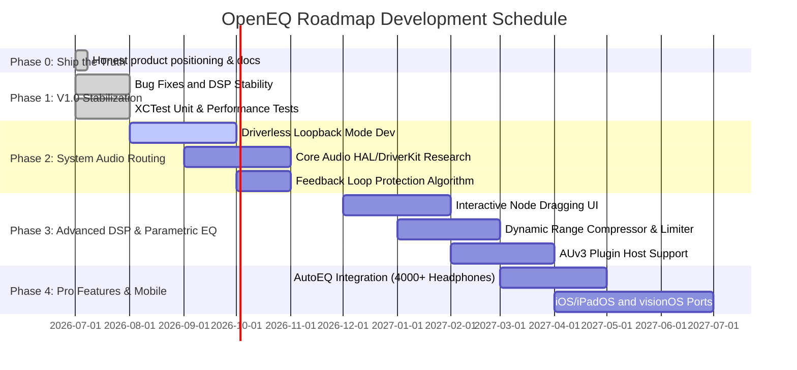

# OpenEQ Development Roadmap

This document outlines the comprehensive development roadmap for the **OpenEQ** audio equalizer application from its V1.0 stable release to the V3.0 vision. The goal of the project is to provide a lightweight, high-performance, open-source, and professional-grade audio processing and routing tool within the macOS ecosystem.

---

## 🗺️ Overview & Phases


```mermaid
gantt
    title OpenEQ Roadmap Development Schedule
    dateFormat  YYYY-MM
    section Phase 0: Ship the Truth
    Honest product positioning & docs    :done, p0_1, 2026-07, 1w
    section Phase 1: V1.0 Stabilization
    Bug Fixes and DSP Stability          :done, p1_1, 2026-07, 1M
    XCTest Unit & Performance Tests      :done, p1_2, 2026-07, 1M
    section Phase 2: System Audio Routing
    Driverless Loopback Mode Dev         :active, p2_1, 2026-08, 2M
    Core Audio HAL/DriverKit Research    :p2_2, 2026-09, 2M
    Feedback Loop Protection Algorithm   :p2_3, 2026-10, 1M
    section Phase 3: Advanced DSP & Parametric EQ
    Interactive Node Dragging UI         :p3_1, 2026-12, 2M
    Dynamic Range Compressor & Limiter   :p3_2, 2027-01, 2M
    AUv3 Plugin Host Support             :p3_3, 2027-02, 2M
    section Phase 4: Pro Features & Mobile
    AutoEQ Integration (4000+ Headphones):p4_1, 2027-03, 2M
    iOS/iPadOS and visionOS Ports        :p4_2, 2027-04, 3M
```

---

## ✅ PHASE 0: Ship the Truth

**Status:** Done. README and docs state what is production vs experimental. System-wide EQ is not oversold.

## ✅ PHASE 1: V1.0 Stability, DSP Improvements & Infrastructure (Q3 2026)

**Status:** Core complete. Focus was stabilizing local + system paths so the app “never cracks.”

### 1.1. Core DSP Improvements & Output Engine Stability
*   **Dynamic Sample Rate Synchronization:** Strengthened `connectGraph` / prepare path for file format changes (local playback).
*   **Parameter Smoothing:** Biquad coefficient interpolation + preamp smoothing on the system DSP path.
*   **Clipping Prevention:** Peak limiter on local/loopback (`AVAudioUnit` peak limiter) and system path (custom peak limiter). Limiter stays on when EQ is bypassed.
*   **Device change safety:** Physical output tracking so aggregate rebuild never loops on OpenEQ’s own device; debounced device churn; emergency safe mode.

### 1.2. UI/UX Polish
*   **Menu bar:** Volume slider, bypass status, last 3 presets, system EQ status, emergency stop.
*   **Permission recovery:** Deep link to Screen & System Audio Recording settings.
*   **Latency readout** on system audio UI.
*   Remaining polish (peak-hold spectrum modes, richer EQ curve): still open.

### 1.3. Testing Infrastructure
*   XCTest coverage for EQBand, presets, spectrum, local engine lifecycle, dB math, limiter configurator (see `docs/TESTING_STRATEGY.md`).

---

## 🌐 PHASE 2: Advanced System Audio & Virtual Driver Routing (Q4 2026 - Q1 2027)

**Focus:** Building a robust, low-latency system-wide EQ routing engine on macOS without causing feedback loops.

```
+------------------+      +-------------------------+      +-------------------------+
|                  |      |    OpenEQ Virtual       |      |    OpenEQ Engine        |
|  System / App    | ---> |    Audio Device (Input) | ---> |    (DSP, EQ, Limiter)   |
|  Audio Output    |      |    (e.g. BlackHole/HAL) |      |    AVAudioEngine/vDSP   |
+------------------+      +-------------------------+      +-------------------------+
                                                                        |
                                                                        v
                                                           +-------------------------+
                                                           |   Physical Audio Output |
                                                           |   (Speakers, Headphones) |
                                                           +-------------------------+
```

### 2.1. Apple Audio DriverKit (Core Audio HAL Plug-in) Integration
*   **User-Friendly Installation:** Bundle a proprietary Core Audio HAL plug-in (or DriverKit Audio driver) that installs with a single click, removing the need for users to manually configure third-party loopback software like BlackHole.
*   **Automatic Routing:** A background service (`SystemAudioManager`) that redirects the system output to the virtual driver upon app launch and restores the original output device on quit.

### 2.2. Dynamic Device Routing
*   **Headphone/Speaker Transits:** Seamless aggregate device reconfiguration when headphones are plugged in or disconnected (AirPods, Wired Headphones, HDMI outputs).
*   **Device-Specific Profiles:** Auto-loading specific user EQ presets depending on the active output accessory (e.g., distinct curves for AirPods Pro vs. internal Mac speakers).

### 2.3. Safety & Feedback Protection
*   **Feedback Loop Detector:** An intelligent safety system that identifies feedback loops (e.g., routing input/microphone streams back into the source) and mutes the DSP engine within milliseconds to prevent hearing damage.

---

## 🎛️ PHASE 3: Advanced DSP and Parametric Equalizer (Q2 2027)

**Focus:** Moving beyond graphic EQ limitations by offering professional-grade parametric filtering and external plugin hosting.

```
       Gain (dB)
          ^
     +12  |           * * * (Band 3: Peaking)
          |         *       *
      0   |--------*---------*---------*--------- (Flat Reference)
          |      *             *     *   *
     -12  |  * *                 * *       * (Band 1: Low Shelf)
          +----------------------------------------------> Frequency (Hz)
             20Hz     100Hz     1kHz      10kHz
```

### 3.1. Fully Interactive Parametric EQ UI
*   **Node Dragging:** Drag EQ points directly on a graph along the vertical axis (Gain) and horizontal axis (Frequency) for intuitive tuning.
*   **Scroll-to-Q:** Alter filter widths (Q factor) dynamically using the trackpad/scroll wheel while hovering over an EQ node.

### 3.2. Professional Dynamics Processing
*   **vDSP-powered Compressor:** Squeeze the dynamic range of audio to improve vocal clarity and balance audio levels.
*   **Brickwall Limiter:** A fast-acting peak limiter at the output stage to guarantee 100% prevention of digital clipping.
*   **Stereo Panning & Balance:** Independent gain and delay control for left and right channels to customize stereo imaging.

### 3.3. AUv3 (Audio Unit v3) Host Infrastructure
*   Host third-party Audio Units (e.g., FabFilter, Valhalla plugins) within the OpenEQ signal chain, allowing users to apply custom DSP effects directly to system audio.

---

## 🚀 PHASE 4: Pro Features, Smart Calibration & Cross-Platform (Q3 2027+)

**Focus:** Extensive headphone preset libraries, automated measurements, and expansion across the Apple device ecosystem.

### 4.1. AutoEQ Integration & Smart Calibration
*   **4000+ Headphone Curves:** Integrate the [AutoEQ](https://github.com/jaakkopasanen/AutoEQ) database to apply optimal target curves for models from Sennheiser, Sony, Apple AirPods, etc.
*   **Measurement File Import:** Support REW (Room EQ Wizard) JSON/TXT export configurations directly to load calculated room acoustics correction filters.

### 4.2. Multi-Channel Output (Surround/Spatial Audio)
*   Support independent EQ calibration per channel for 5.1, 7.1, and Dolby Atmos audio setups.

### 4.3. Apple Ecosystem Expansion (iOS, iPadOS, visionOS)
*   Adapt the SwiftUI frontend for iPad and Apple Vision Pro, sharing the underlying Core Audio and vDSP processing engine. Cloud synchronization will share custom presets across devices.

---

## 📈 Release Matrix

| Feature / Component | V1.0 (Now — Phase 0/1) | V2.0 (End of Phase 2) | V3.0 (Phase 3 & 4) |
| :--- | :--- | :--- | :--- |
| **Audio Source** | Local files + experimental System-Wide EQ (CATap) | Full routing + optional virtual driver | Multi-channel / network |
| **Graphic EQ Bands** | 10 & 31 (smoothed system DSP) | Driver-compatible 31-band | Unlimited / AutoEQ profiles |
| **Parametric EQ** | 5 bands + curve view | 8 bands + node dragging | Dynamic bands + AUv3 hosting |
| **Latency** | ~buffer-dependent (shown in UI) | Lower with virtual driver | Near zero (&lt; 2.5ms goal) |
| **OS Compatibility** | macOS 14.0+ (local), 14.2+ (system EQ) | macOS 14.2+ | macOS, iPadOS, visionOS |
| **Safety** | Unified bypass, peak limiter, safe mode | Feedback / howling guard | — |
