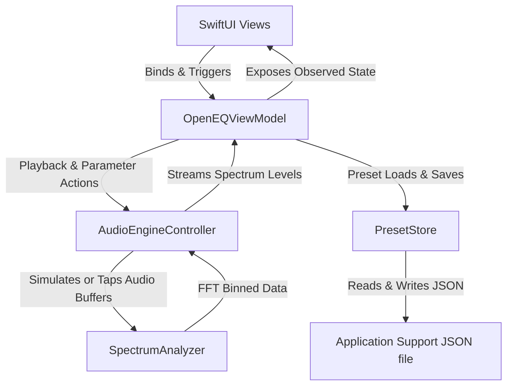

# OpenEQ Architecture Specifications

This document outlines the architectural boundaries and data flows of **OpenEQ**, a modular macOS audio equalizer application.

## 1. SwiftUI UI Layer
- **MainWindowView**: Combines the application header, the spectrum display, the fader sliders, and the sidebar panel.
- **SpectrumView**: High-performance canvas-based visualization rendering 64 binned magnitudes at 60 FPS.
- **EqualizerView**: Contains fader components for preamp and individual bands.
- **PlayerControlsView**: Displays playback state, time scrubbers, volume controls, and file picker.
- **PresetPanelView**: Renders built-in/user lists and preset save/import options.

## 2. ViewModel Layer
- **OpenEQViewModel**: Exposes `@Observable` properties to SwiftUI.
  - Serves as the single source of truth for UI configurations, active file paths, volumes, and custom presets.
  - Controls flow validation (e.g. preventing built-in preset deletion, checking empty selections).
  - Routes actions asynchronously to the audio engine controller.

## 3. AudioCore Engine
- **AudioEngineController**: Owns the native AVFoundation graph.
  - Instantiates `AVAudioEngine`, `AVAudioPlayerNode`, and `AVAudioUnitEQ`.
  - Reconnects nodes dynamically on file load to prevent sample rate mismatches.
  - Handles logarithmic decibel preamp mapping: `volume = pow(10.0, db / 20.0)`.
  - Installs an audio tap on `mainMixerNode` to extract audio samples.

## 4. Signal Processing (FFT Analysis)
- **SpectrumAnalyzer**: Handles Discrete Fourier Transforms via Accelerate vDSP.
  - Captures 1024 float samples.
  - Applies a Hanning window (`vDSP_hann_window`) to minimize spectral leakage.
  - Performs forward FFT on split complex representation via `vDSP_fft_zrip`.
  - Computes power magnitudes (`vDSP_zvmags`), converts values to decibels, normalizes values from `[-60dB, -5dB]` to `[0.0, 1.0]`, and applies decay smoothing filter.

## 5. PresetStore Serialization
- **PresetStore**: Manages settings storage.
  - Resolves path to standard local storage: `~/Library/Application Support/OpenEQ/presets.json`.
  - Encodes/decodes lists of custom configurations as pretty-printed JSON arrays.
  - Handles NSSavePanel/NSOpenPanel export-import operations securely, renewing unique identifiers to prevent ID collisions.
