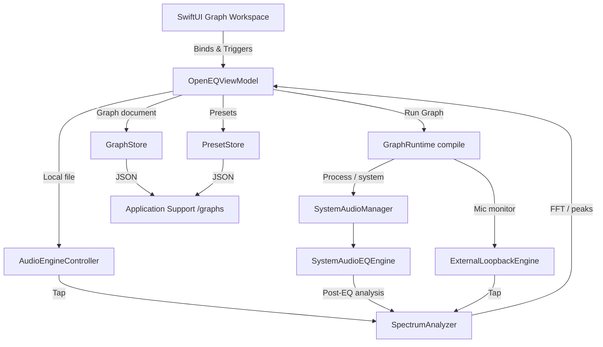

# OpenEQ Architecture Specifications

Modular macOS audio equalizer: local file playback, experimental system/per-app process taps, and a node routing graph.


```mermaid
graph TD
    A[SwiftUI Graph Workspace] -->|Binds & Triggers| B[OpenEQViewModel]
    B -->|Graph document| G[GraphStore]
    B -->|Run Graph| R[GraphRuntime compile]
    R -->|Process / system| S[SystemAudioManager]
    R -->|Mic monitor| L[ExternalLoopbackEngine]
    B -->|Local file| C[AudioEngineController]
    S --> T[SystemAudioEQEngine]
    C -->|Tap| D[SpectrumAnalyzer]
    T -->|Post-EQ analysis| D
    L -->|Tap| D
    D -->|FFT / peaks| B
    B -->|Presets| E[PresetStore]
    G -->|JSON| F[Application Support /graphs]
    E -->|JSON| F
```

## 1. SwiftUI UI layer

- **MainWindowView** — NavigationSplitView: palette sidebar + **routing graph** canvas + inspector  
- **GraphWorkspaceView / GraphCanvasView** — node/edge canvas, Run/Stop, live meters  
- **NodeInspectorView** — per-node settings (EQ curve, app picker, device pickers)  
- **SidebarView** — node palette, live apps, presets, headphones, dynamics, AUv3  
- **SystemAudioView** — advanced mode sheet, permission recovery, emergency stop  
- **MenuBarView** — bypass, recent presets, system status  
- **PlayerControlsView** — local file transport (shown when a File node is present)

## 2. ViewModel layer

- **OpenEQViewModel** (`@Observable`) — single UI source of truth  
  - Local playback → `AudioEngineController`  
  - System / per-app / mic monitor → `SystemAudioManager` via **Run Graph**  
  - **Unified EQ policy**: graph EQ node (or legacy bands) feeds every engine  
  - Topology changes while live → debounced graph re-run  
  - Safe mode / shutdown restore system routing  

## 3. Routing graph

- **GraphDocument** — nodes, edges, schema version; starter template = System → EQ → Output  
- **GraphStore** — selection, connect/delete, autosave, topology callbacks  
- **GraphValidation / GraphRuntime** — acyclic chains; compile to process tap or input monitor  
- **v1 limits**: one process-tap chain *or* one mic monitor (not both); no multi-source mix  

Supported chains:

```
appSource | systemSource → equalizer → [dynamics?] → output
inputSource → equalizer → [dynamics?] → output
fileSource → equalizer → output   (file uses local AVAudioEngine)
```

## 4. AudioCore — local path

- **AudioEngineController**
  - Graph: `AVAudioPlayerNode` → `AVAudioUnitEQ` → dynamics → optional AUv3 → peak limiter → `mainMixerNode`  
  - Reconnects on sample-rate / channel-count change  
  - Limiter stays engaged when EQ is bypassed  
- **AUv3PluginHost** — local file insert only (not system-wide)

## 5. AudioCore — system / process path

- **SystemAudioManager** — mode orchestration, device snapshot, debounced rebuilds  
- **SystemAudioEQEngine** (macOS 14.2+)
  - `ProcessTapTarget`: system-wide, process object IDs, or bundle IDs (macOS 26+)  
  - `CATapDescription` + private aggregate; physical output tracked separately  
  - Manual biquad DSP + peak limiter + feedback guard  
  - Restores original default output on stop / failure / quit  
- **ExternalLoopbackEngine**
  - Hardware input → EQ → limiter → output (**mic monitor**, not a virtual mic for Teams)  
- **AudioProcessEnumerator** — HAL process list for Live Apps palette  

See [system-audio.md](system-audio.md).

## 6. Spectrum analysis

- **SpectrumAnalyzer** (Accelerate vDSP)
  - 1024-sample FFT, Hanning window, power → dB → normalized bars  
  - Levels drive main meters and **mini node meters** on the canvas  

## 7. Presets & calibration

- **PresetStore** — `~/Library/Application Support/OpenEQ/presets.json`  
- **GraphStore** — `…/OpenEQ/graphs/default.json`  
- **AutoEQCatalog** / **CalibrationImporter** / **HeadphoneLibraryView**  

## 8. Platform

- macOS is the shipping host; iOS/visionOS expansion plan lives in `docs/platform.md`.  
- Do not claim a shipped virtual HAL mic/driver — CATap + monitor path only.  
- `ChannelLayout` marks multi-channel as a foundation only.
