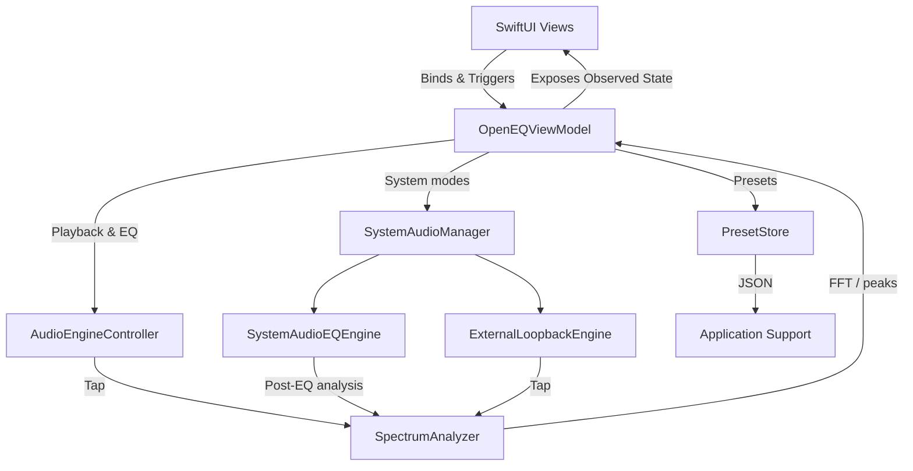

# OpenEQ Architecture Specifications

Modular macOS audio equalizer: local file playback and experimental system-wide processing.

```mermaid
graph TD
    A[SwiftUI Views] -->|Binds & Triggers| B[OpenEQViewModel]
    B -->|Exposes Observed State| A
    B -->|Playback & EQ| C[AudioEngineController]
    B -->|System modes| S[SystemAudioManager]
    S --> T[SystemAudioEQEngine]
    S --> L[ExternalLoopbackEngine]
    C -->|Tap| D[SpectrumAnalyzer]
    T -->|Post-EQ analysis| D
    L -->|Tap| D
    D -->|FFT / peaks| B
    B -->|Presets| E[PresetStore]
    E -->|JSON| F[Application Support]
```

## 1. SwiftUI UI layer

- **MainWindowView** — header, spectrum, equalizer, sidebar presets, player controls  
- **SpectrumView** — Canvas spectrum + level meters + clipping indicator  
- **EqualizerView / ParametricEQView** — graphic or parametric controls  
- **SystemAudioView** — mode picker, start/stop, permission recovery, emergency stop  
- **MenuBarView** — bypass, volume, recent presets, system status  

## 2. ViewModel layer

- **OpenEQViewModel** (`@Observable`) — single UI source of truth  
  - Local playback actions → `AudioEngineController`  
  - System modes → `SystemAudioManager`  
  - **Unified EQ policy**: same bands/preamp/bypass for every engine  
  - Preset load/save via `PresetStore`  
  - Safe mode / shutdown restore system routing  

## 3. AudioCore — local path

- **AudioEngineController**
  - Graph: `AVAudioPlayerNode` → `AVAudioUnitEQ` → peak limiter → `mainMixerNode`  
  - Reconnects on sample-rate / channel-count change  
  - Preamp via linear gain on player volume (`pow(10, dB/20)`)  
  - Limiter stays engaged when EQ is bypassed  

## 4. AudioCore — system path

- **SystemAudioManager** — mode orchestration, device snapshot, debounced rebuilds  
- **SystemAudioEQEngine** (macOS 14.2+)
  - `CATapDescription` process tap + private aggregate device  
  - Tracks **physical** output separately from the aggregate (critical for rebuild safety)  
  - Manual biquad DSP with coefficient smoothing + peak limiter  
  - Restores original default output on stop / failure / app quit  
- **ExternalLoopbackEngine**
  - `AVAudioEngine` input → EQ → limiter → mixer  
  - Expects user-managed virtual device (e.g. BlackHole)  

See [system-audio.md](system-audio.md).

## 5. Spectrum analysis

- **SpectrumAnalyzer** (Accelerate vDSP)
  - 1024-sample FFT, Hanning window, power → dB → normalized bars  
  - Peak / clip metadata for meters  

## 6. Presets

- **PresetStore** — `~/Library/Application Support/OpenEQ/presets.json`  
- Built-in presets + user presets; import/export renews IDs on import  

## 7. Permissions & privacy

- System EQ: Screen & System Audio Recording  
- Info.plist usage strings for audio capture / microphone (loopback)  
- All processing is local; no cloud audio upload  
